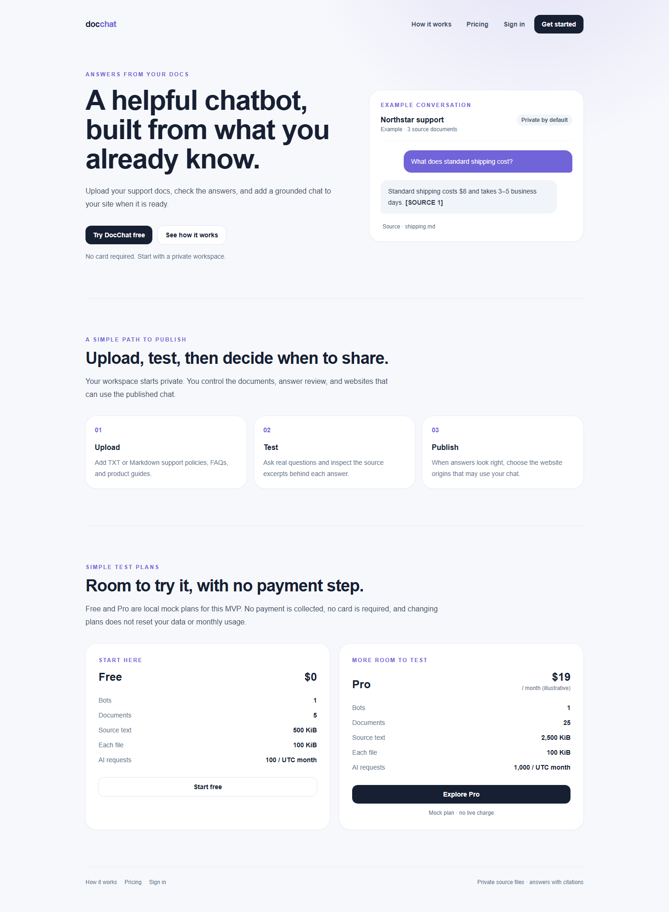
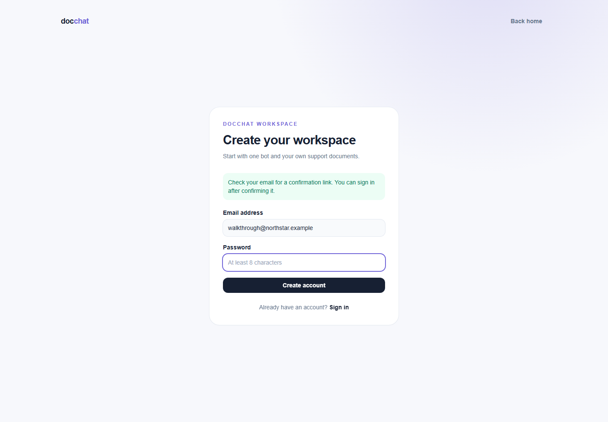
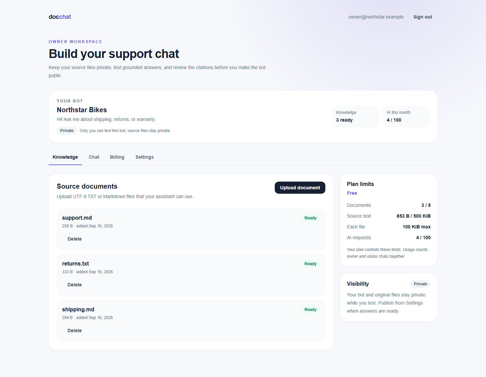
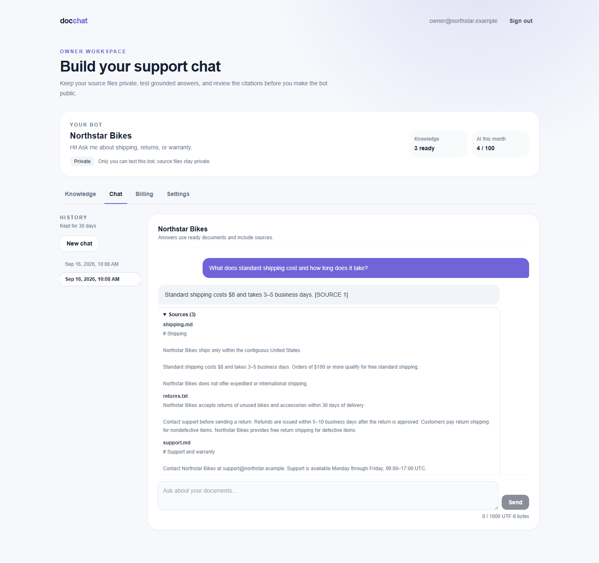
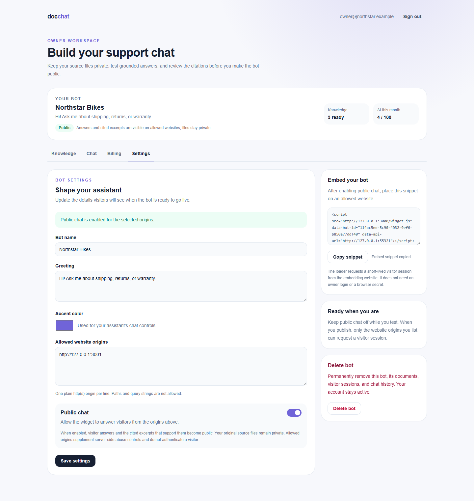
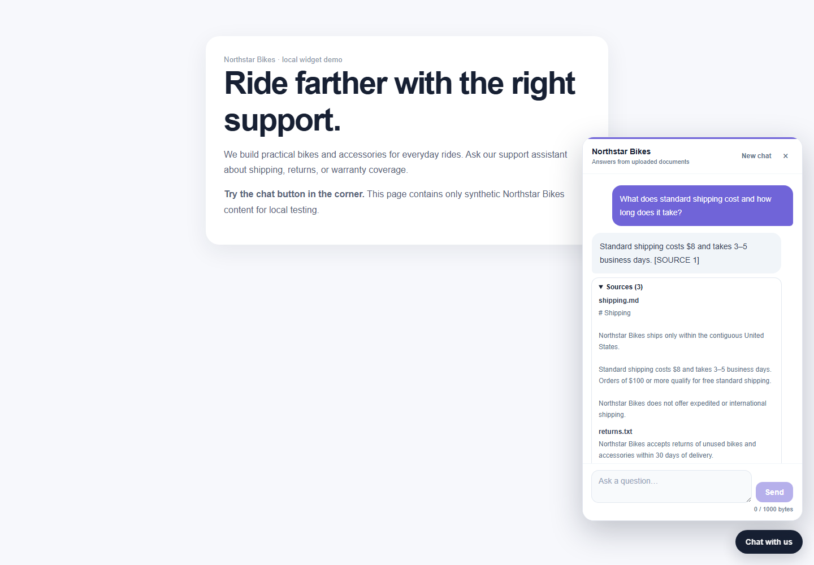
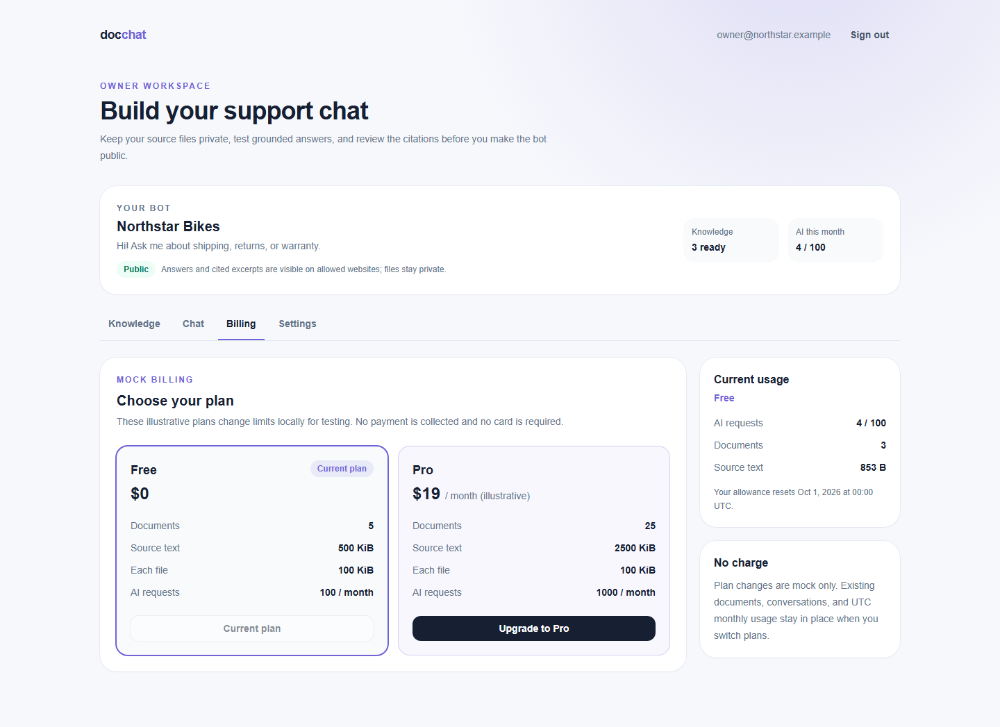
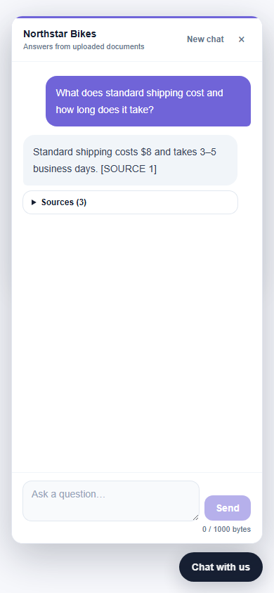
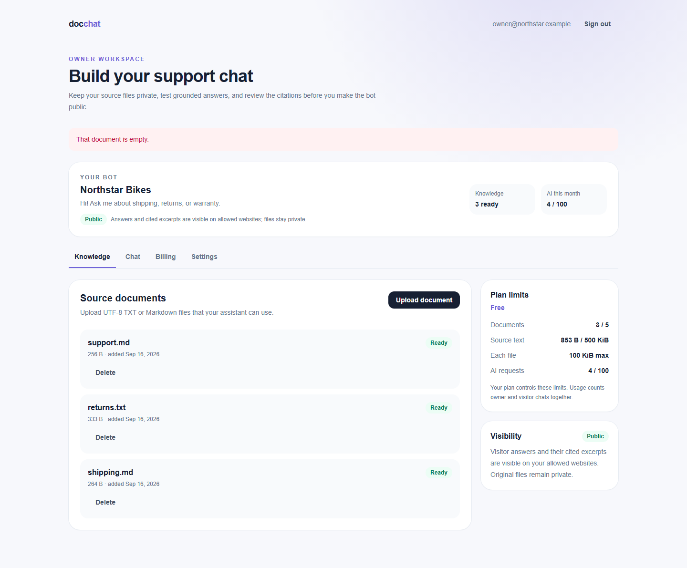
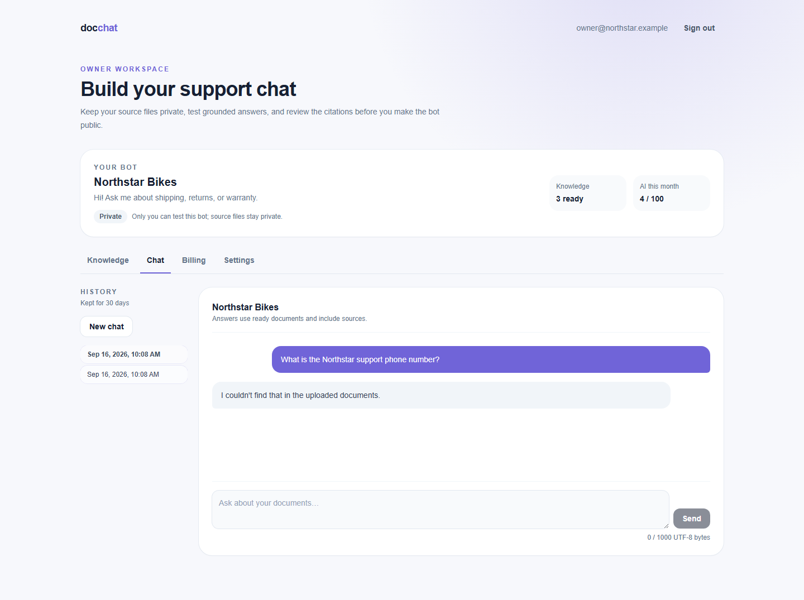

# DocChat walkthrough

This walkthrough uses the synthetic Northstar Bikes workspace and the local services described in [README.md](README.md). All ten screenshots were captured and visually checked against the running local production build.

The final walkthrough bot is `114ac5ee-5c90-4032-9ef6-b850a77ddf40`. Its safe public demo is [Northstar Bikes support](http://127.0.0.1:3001/?bot_id=114ac5ee-5c90-4032-9ef6-b850a77ddf40). Accounts and documents shown in these steps are synthetic local fixtures. Credentials are intentionally omitted.

To inspect the existing owner workspace, use **Forgot your password?** for `owner@northstar.example` and follow the reset message in local Mailpit. Alternatively, create your own account and repeat the steps. The confirmation screenshot shows a separate temporary signup fixture; the workspace screenshots show the persistent demo owner. Counters reflect the additional verification questions asked during testing.

## 1. Landing page

Open http://127.0.0.1:3000. The landing page explains the upload → test → publish path, shows the Free limits and illustrative Pro limits, and states that local billing is mock and uncharged. Select **Try DocChat free**.

## 2. Confirm the account

Create an account with an email and password. The app shows a check-email state and does not enter the workspace before confirmation. Open local Mailpit at http://127.0.0.1:55324, follow the Supabase confirmation link, and sign in when prompted.

## 3. Add knowledge

Create one bot named Northstar Bikes. In **Knowledge**, upload `demo/shipping.md`, `demo/returns.txt`, and `demo/support.md`. Each row moves through processing and ends at **Ready** with its size and status. The private source-file notice remains visible; the source files are never exposed by the widget.

## 4. Test the owner chat

Open **Chat**, ask “What does standard shipping cost and how long does it take?”, and wait for the real streamed answer. The transcript shows the answer and expandable source excerpts. After reloading, open Chat and select the saved conversation from History to restore it. A question about an undocumented phone number produces the clear insufficient-information response without invented contact details.

## 5. Publish from Settings

Open **Settings**, review the name, greeting, accent, and allowed origin fields, and enter `http://127.0.0.1:3001`. Read the disclosure before enabling public chat: answers and cited excerpts become public, original files stay private, and allowed origins supplement server-side controls. Save and copy the selectable widget snippet.

## 6. Try the external widget

Run `npm run demo` and open the public demo link above. Select the launcher, ask the same shipping question, and inspect the streamed answer and sources in the compact panel. The visitor session travels through the loader and a checked iframe `postMessage` handshake; the token is not in the URL and the visitor request does not use the owner's bearer session.

## 7. Review mock billing

Open **Billing** in the owner workspace. Free is `$0`; Pro is `$19 / month (illustrative)`. The card lists document, source-size, per-file, and monthly AI limits. Upgrade and downgrade are explicitly marked mock/no charge, and the current usage plus UTC reset remain unchanged after the plan change.

## 8. Check the mobile widget

Resize the external page or open it at a narrow viewport. The launcher, transcript, source details, and composer remain usable without horizontal overflow; the transcript scrolls independently while the composer stays visible.

## 9. See an upload error

In **Knowledge**, try an empty file or an unsupported/oversized file. The UI reports a clear validation error and keeps existing ready documents intact. The screenshot shows the client-side empty-file guard; the integration runner also verifies rejection at the server boundary. Upload a valid TXT or Markdown file to continue processing.

## 10. Optional insufficient-information check

Ask the owner or widget “What is the Northstar support phone number?” The answer states that the uploaded documents do not contain that fact and shows no source citation for an unsupported answer.

